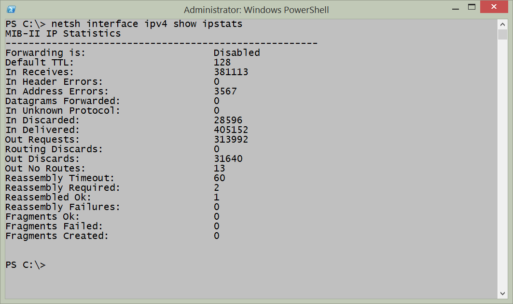
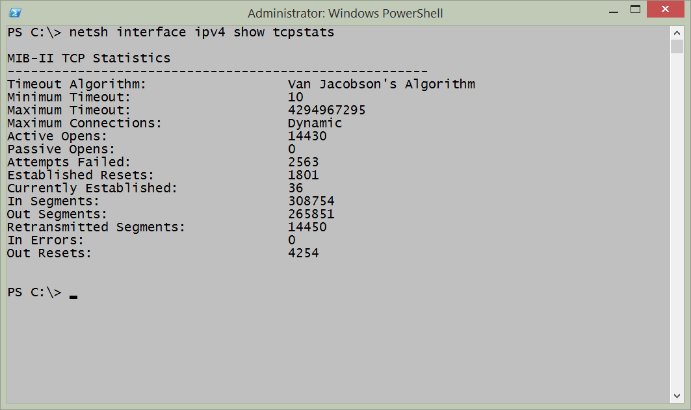
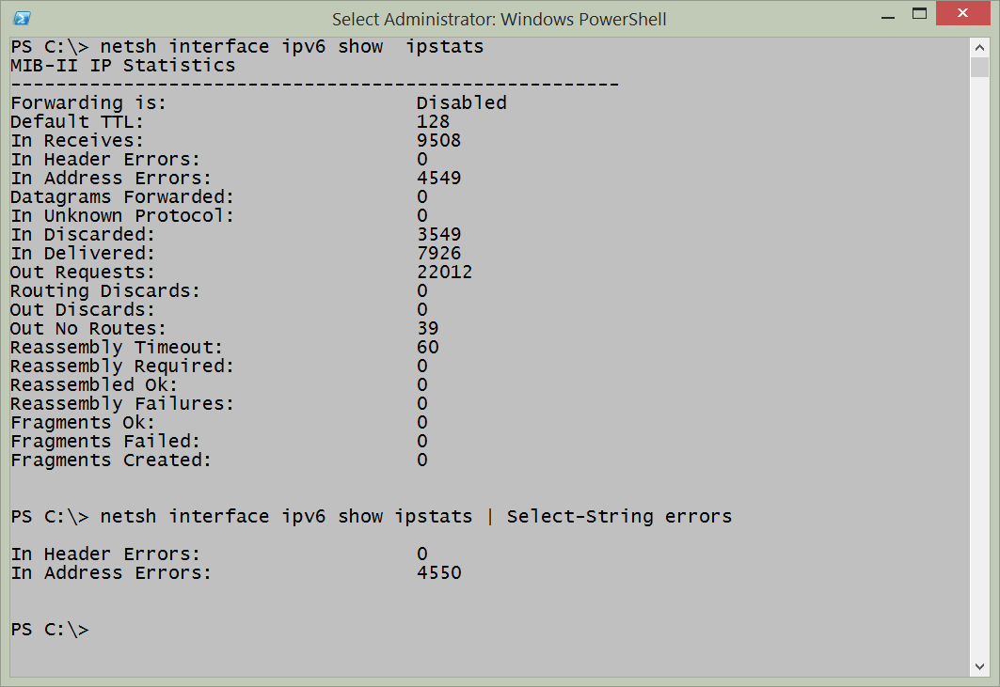
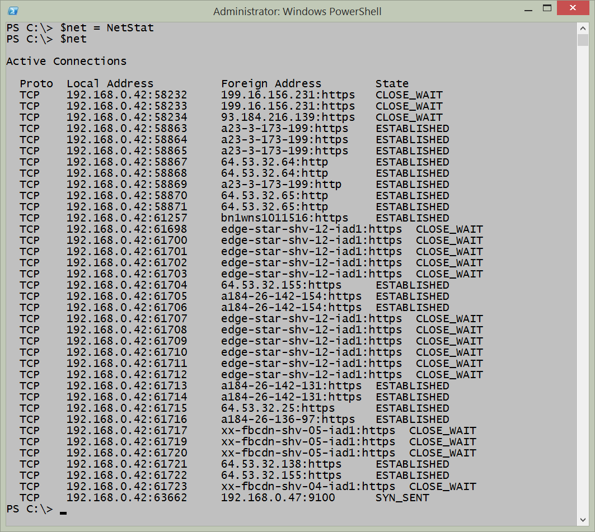
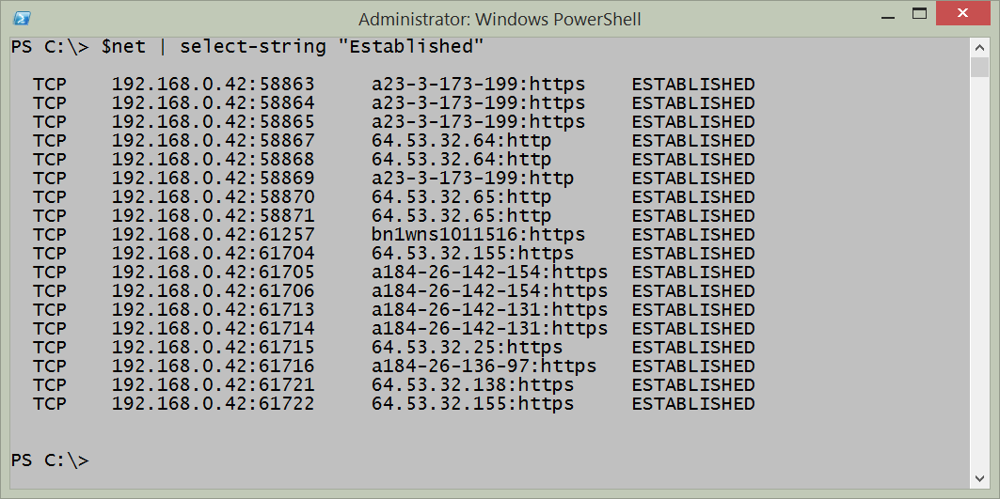
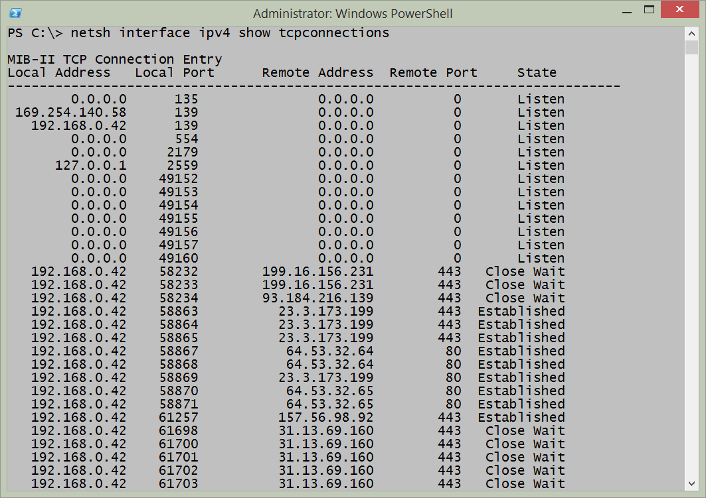
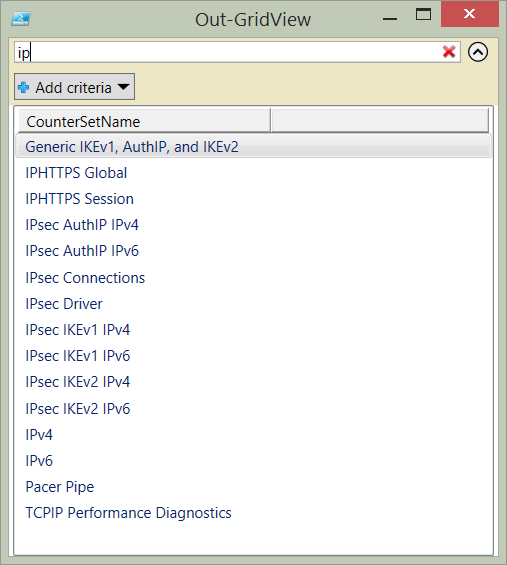
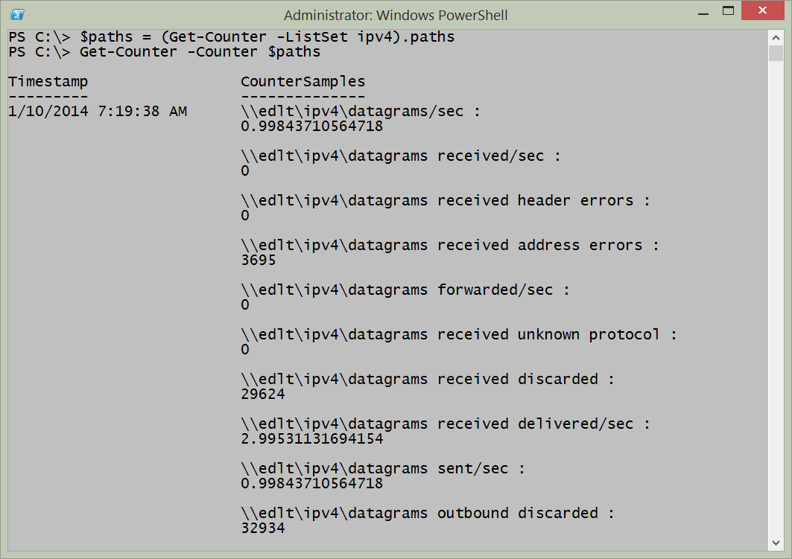
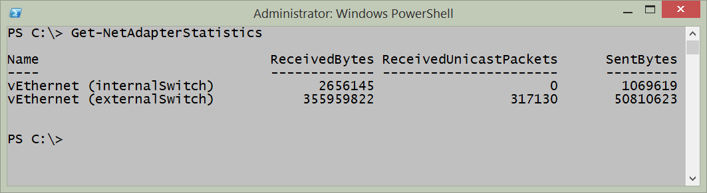
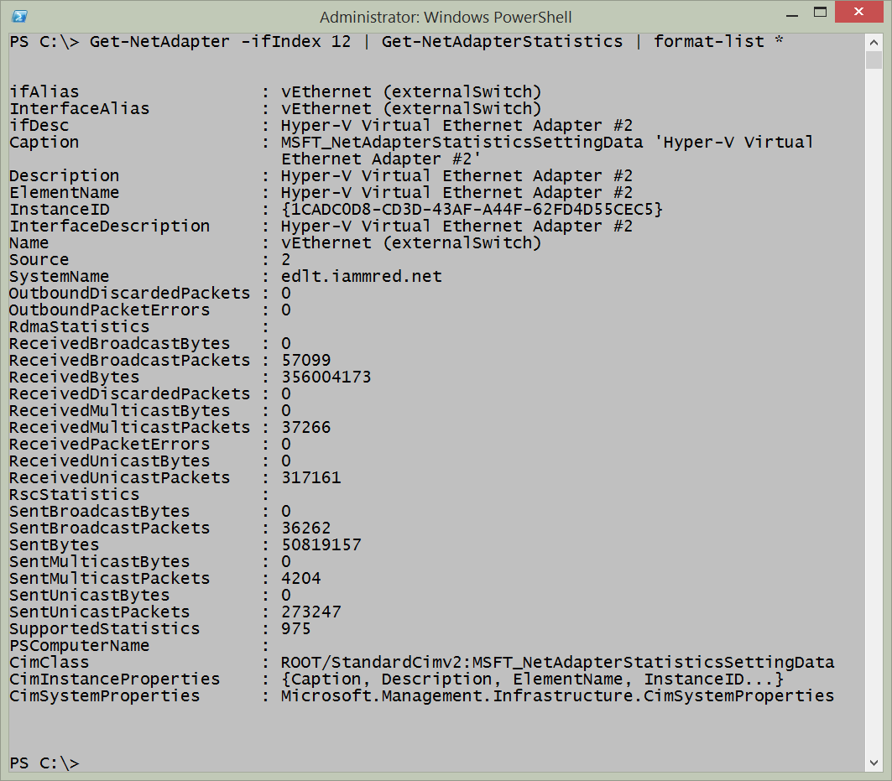

# Getting Network Statistics
One of the cool things about the Windows platform are all the different ways of obtaining networking statistical information. There are things like NetStat, NetSh, performance counters, as well as the Get-NetworkStatistics function from the NetAdapter Windows PowerShell module. All of these methods can be used inside the Windows PowerShell console, or from within the Windows PowerShell ISE.

**PowerTip** : Use PowerShell to find Networking counters

Question: You need to check on the network performance, but do not know where to begin. How can you use Windows PowerShell to find networking counters?

Answer: Use the Get-Counter cmdlet and the -ListSet parameter. Select the CounterSetName property and filter on names related to networking. The following command returns sets related to IPV6.
````
Get-Counter -ListSet * | select countersetname | where countersetname -match 'ipv6' 
````
## NetSh

Using NetSh to obtain network statistics is easy and powerful. For example to show IP statistics, I use the command appearing here.
````
netsh interface ipv4 show ipstats
````
A sample output from this command appears in the figure that follows.



To show TCP statistics using NetSh, I use the command appearing here.
````
netsh interface ipv4 show tcpstats
````
The command, and the output from the command appear in the figure that follows.



One of the cool things about using NetSh from within Windows PowerShell is that I have the power of Windows PowerShell at my fingertips. Rather than keep going back and forth to find stuff, I can pipeline the results from a command to the Select-String cmdlet. For example, if I am interested in how many commands are available to show statistics, I use the command appearing here because I noticed that each of the commands contains the letters stats:
````
netsh interface ipv4 show | Select-String "stats"
````
The output from the command appears here:
````
PS C:\> netsh interface ipv4 show | Select-String "stats"

show icmpstats - Displays ICMP statistics.

show ipstats  - Displays IP statistics.

show tcpstats - Displays TCP statistics.

show udpstats - Displays UDP statistics.
````
In addition to the IPV4 interface, I can also work with the IPV6 interface and obtain similar statistics. Here is the command I used to obtain that information:
````
PS C:\> netsh interface ipv6 show | Select-String "stats"

show ipstats  - Displays IP statistics.

show tcpstats - Displays TCP statistics.

show udpstats - Displays UDP statistics.
````
In addition to using the Select-String cmdlet to parse the output from the NetSh help, I can also use it to hone in on specific information from the statistics. For example, the following command retrieves IPv6 interface IP stats.
````
netsh interface ipv6 show ipstats
````
I can hone in on the output and look for errors by piplining the results to the Select-String cmdlet and choosing error. This command appears here.
````
netsh interface ipv6 show ipstats | Select-String errors
````
In the figure that follows, I first show the command to retrieve the IPV6 IP statistics. Next I show the output from the command. Then I filter the output to only errors by using the Select-String cmdlet and lastly, I show the output from the filtered string.




## NetStat

The NetStat command has been around in the Windows world for a long time. It provides a quick snapshot of connections from local ports to remote ports as well as the protocol and the state of those connections. It takes a couple of minutes to run, and as a result it makes sense to store the results of NetStat into a variable. I can then examine the information several times if I wish without having to wait each time to gather the information additional times. Here is an example of running the NetStat command and storing the results from in a variable.
````
$net=NetStat
````
To display the information in an unfiltered fashion, I just type $net at the Windows PowerShell prompt and it displays all of the information that it gathered. Here is an example:
````
$net
````
The command to run NetStat and store the results in a variable as well as to examine the contents of the $net variable appear in the figure that follows.



The real power, however, comes in using Windows PowerShell to parse the text output to find specific information. For example, the previous output shows multiple connections in various states of connectiveness. I can easily parse the output and find only the connections that are Established. The command I use appears here.
````
$net|select-string "Established"
````
The command and the output from the command appear in the figure that follows.



Interestingly enough, I can also use NetSh to report on TCP connections. The command appears here:
````
netsh interface ipv4 show tcpconnections
````
The output from the command, as appears in the figure that follows, is a bit different than that received from NetStat.



## Performance Counters

To collect performance counter information, I need to know the performance counter set names so I can easily gather the information. To do this, I use the Get-Counter cmdlet and I choose all of the listsets. I then like to sort on the countersetName property and then select only that property. The following command retrieves the available listsets.
````
Get-Counter -ListSet * | 
Sort-Object CounterSetName |
Select-Object CounterSetName 

````
If I pipeline the output to the Out-GridView cmdlet, then I can easily filter the list to find the listsets I wish to use. This command appears here.
````
Get-Counter -ListSet * | 
Sort-Object CounterSetName |
Select-Object CounterSetName |
Out-GridView 

````
The resulting Out-GridView pane makes it easy to filter for different values. For example, the figure that follows filters for IP.



Once I have the countersetname value I wish to query, it is a simple matter of plugging it into the Get-Counter to first obtain the paths. This command appears here.
````
$paths = (Get-Counter -ListSet ipv4).paths 
````
Next I use the paths with the Get-Counter cmdlet to retrieve a single instance of the IPv4 performance information. The command appears here.
````
Get-Counter -Counter $paths 
````
The commands and the output from the commands appear in the figure that follows.



If I want to monitor a counter set for a period of time, I use the -SampleInterval property and the -MaxSamples parameter. In this way I can specify how long I want the counter collection to run. An example of this technique appears here.
````
Get-Counter -Counter $paths -SampleInterval 60 -MaxSamples 60 
````
If I want to monitor continuously, until I type Ctrl-C and break the command, I use the -Continuous parameter and the -SampleInterval parameter. An example of this command appears here.
````
Get-Counter -Counter $paths -SampleInterval 30 -Continuous 
````
## Using Get-NetAdapterStatistics function

The easiest way to gather network adapter statistics is to use the Get-NetAdapterStatistics function from the NetAdapter module. It provides a quick overview of the sent and received packets. An example of the command appears here.
````
Get-NetAdapterStatistics
````
The command and a sample output appear in the figure that follows.



If I want to work with a specific network adapter I can use the name of the adapter, or for more flexibility I can pipeline the results from the Get-Netadapter function. This technique appears here.
````
Get-NetAdapter -ifIndex 12| Get-NetAdapterStatistics
````
The Get-NetAdapterStatistics function returns more than just bytes sent and received. To find the additional information I like to pipeline the results to the Format-List cmdlet. An example of this technique appears here.
````
Get-NetAdapter -ifIndex 12| Get-NetAdapterStatistics | format-list\*
````
The command, and the output associated with the command appear in the figure that follows.


