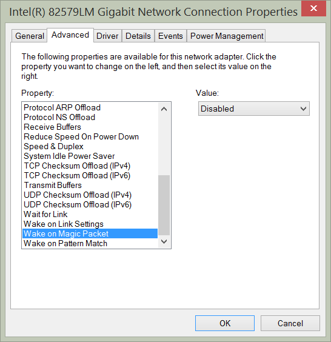
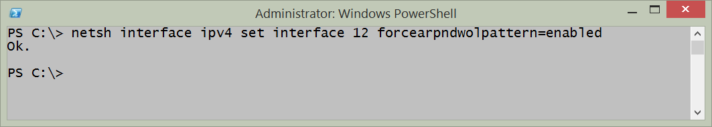
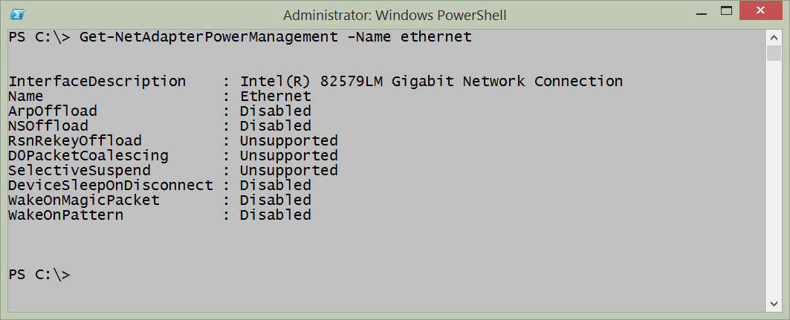
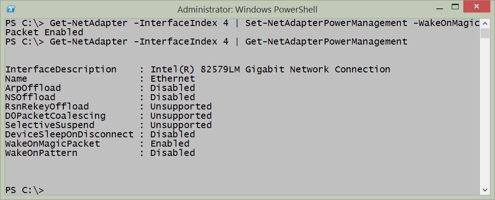
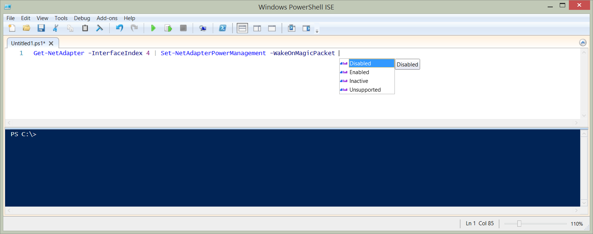
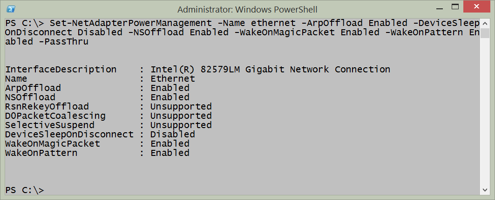
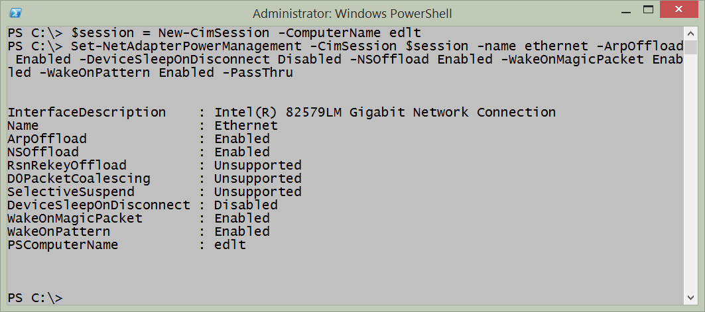
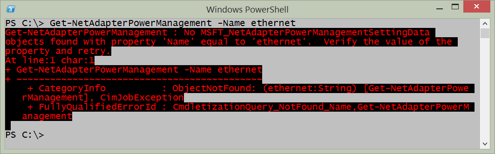

# Network Adapter power settings
Beginning with Windows 7, the [network adapter power settings expanded](http://technet.microsoft.com/en-us/library/ee617165(v=WS.10).aspx). Some of the improvements are listed here:

- Wake on LAN and Wake on Wireless LAN. Improved wake patterns reduce the number of false wakes. Beginning with Windows 7 a directed packet (such as a ping) does not cause the computer to wake up.
- ARP (Address Resolution Protocol) and NS (Neighbor Solicitation) offload. ARP and NS packets do not wake up the computer. Instead the network adapter, beginning with Windows 7, can respond. Therefore the computer does not need to wake up just to maintain a presence on the network. This support depends on at least NDIS 6.0 drivers and may not be available with older hardware.
- Low Power on Media Disconnect. Enables the computer to place the network adapter into a low power state when the network cable is unplugged and the computer is running. 

These settings are configurable via the graphical user interface by selecting the configure button from the network adapter properties dialog box. The settings appear in the figure that follows.



**PowerTip** : Get network adapter power management settings

Question: You want to get the network adapter power management settings on your Window 8.1 computer. How can you use Windows PowerShell to do this?

Answer: Use the Get-NetAdapterPowerManagement function and specify the name of the network adapter to query. 
````
Get-NetAdapterPowerManagement-Name ethernet
````


## Using NetSh

Some of the network adapter power management settings are configurable via NetSh. For example, to permit ARP packets and NS packets to wake the network adapter, I would use a command such as the following:
````
netsh interface ipv4 set interface 12 forcearpndwolpattern=enabled
````
When the command completes successfully, it returns OK. Keep in mind, this will also cause a network adapter reset. The command and associated output appear here:



## Using the NetAdapter module

To query the power management settings for a specific network adapter, use the Get-NetAdapterPowerManagement function and specify the name of the network adapter. An example of the command appears here:
````
Get-NetAdapterPowerManagement -Name ethernet
````
The command, and the output associated with the command appear in the figure that follows.



The Get-NetAdapterPowerManagement function only permits the use of the adapter name or interface description as parameters. But the Get-NetAdapter function is much more flexible. I often use Get-NetAdapter to retrieve a specific network adapter and then pipeline it to other functions such as Get-NetAdapterPowerManagement. This technique appears here:
````
Get-NetAdapter -Interface Index4 | Get-NetAdapterPowerManagement
````
To configure the network adapter power management, I use the Set-NetAdapterPowerManagement function. Once again, I want to retrieve my network adapter by interface index number instead of having to type the name or description of the adapter. I pipeline the resulting network adapter object to the Set-NetAdapterPowerManagement function and specify a value for the -WakeOnMagicPacket parameter. The command appears here.
````
Get-NetAdapter -Interface Index4 | Set-NetAdapterPowerManagement -WakeOnMagicPacket Enabled
````
Because no output returns from the command, I use the Get-NetAdapter command a second time to verify the configuration change took place. The commands and associated output appear in the figure that follows.



Now, it so happens that I know what the permissible values are for the parameters. But if I did not know this, I could create the command in the Windows PowerShell ISE and rely upon the intellisense features. When I type a parameter name, the permissible values appear and make it possible to select the correct value from the list. This appears in the figure that follows.



Most of the times, when I need to manage network adapter power management settings, it is because of a new deployment, or because an audit has determined that I have configuration drift. (Hmmm - this would actually be a great thing to use Desired Configuration Management to control.) So, what I do is put all the settings I want to configure into a single command. Such a command appears here:
````
Set-NetAdapterPowerManagement -Name ethernet -ArpOffload Enabled -DeviceSleep OnDisconnect Disabled -NSOffload Enabled -WakeOnMagicPacket Enabled -WakeOnPattern Enabled -PassThru 

````
The -passthru parameter outputs a configuration management object so that I can inspect it and ensure that the proper things change that I wanted changed. The command, and the output from the command appear in the figure that follows:



To make changes to multiple computers, I first use the New-CimSession cmdlet to make my remote connections. I can specify the computer names and the credentials to use to make the connection. I then store the remote connection in a variable. Next, I pass that cimsession to the -cimsession parameter. The key to remember here, is that I must be able to identify the network adapter that I need to use for the management activity. An example of creating a Cim Session and using it appears here (keep in mind this is a two line command. If you directly copy and paste this command you must change the computer name, network interface name, and remove spaces until the second command appears on a single line).
````
$session = New-CimSession -ComputerName edlt
Set-NetAdapterPowerManagement -CimSession $session -name ethernet -ArpOffload Enabled -DeviceSleepOnDisconnect Disabled -NSOffload Enabled -WakeOnMagicPacket Enabled -WakeOnPattern Enabled -PassThru 
````
The command and the output from the command appear in the figure that follows.



Keep in mind that these commands require that either the Windows PowerShell console or the Windows PowerShell ISE is opened with admin rights. To do this, right click on the Windows PowerShell console icon or Windows PowerShell ISE icon while holding down the shift key and select run as administrator. Or if you launch it via Windows Search on Windows 8.1 type Windows PowerShell from the Start page, and the Search dialog appears with the Windows PowerShell icon. Right click on the icon and select Run as Administrator from the action menu.

If you do not launch Windows PowerShell with admin rights, an error occurs stating that it cannot find the network adapter. An example of the error appears in the figure that follows.



