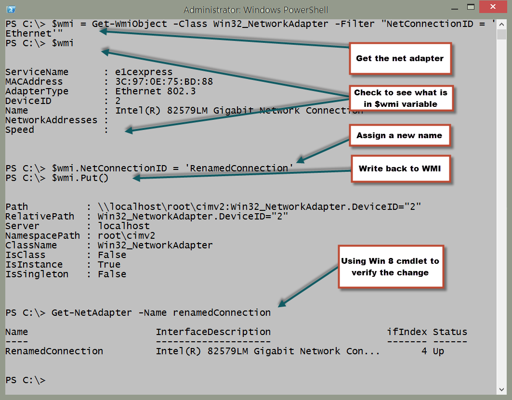
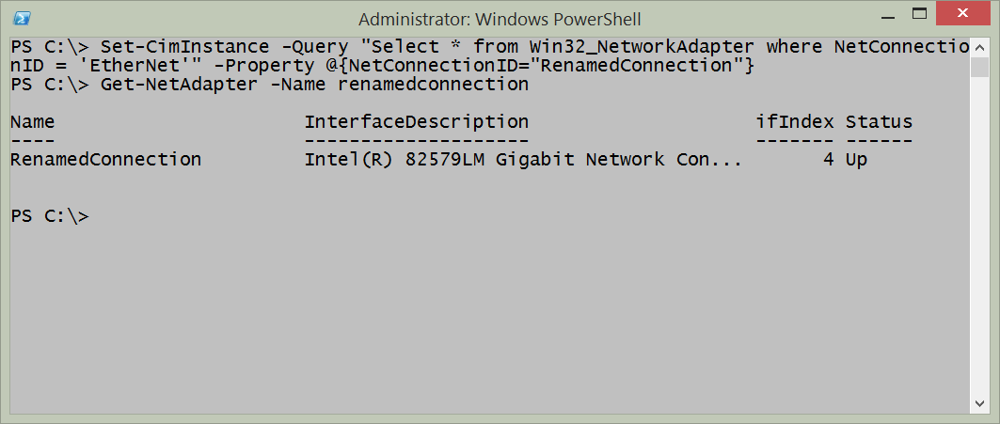
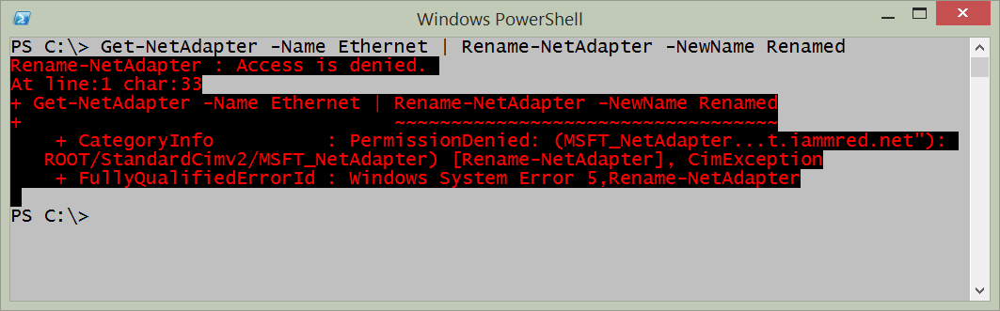
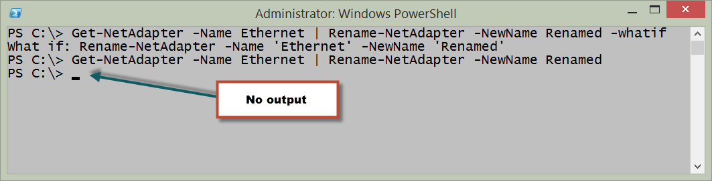
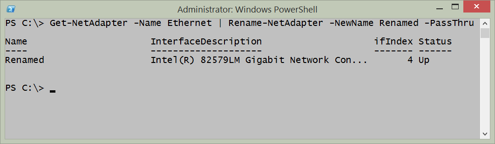

# Renaming the network adapter
Depending on the version of your operating system, you will have different capabilities available for renaming the network adapter. These methods involve using Netsh, WMI, and the functions from the NetAdapter module. 

**PowerTip** : Renaming the network adapter

Question: You want to rename you network adapter. How can you do this using Windows PowerShell on Windows 8 or above?

Answer: Use the Get-Netadapter function to retrieve the specific network adapter and pipeline the results to the Rename-NetAdapter function. This technique appears here:
````
Get-NetAdapter -Name Ethernet|Rename-NetAdapter -NewName MyRenamedAdapter
````
## Using NetSh

To rename the network adapter using NetSh I need to know the interface name, and the new name I want to use. This is about it. To find the network adapter names, I can also use NetSh. Here is the command:
````
netsh interface ipv4 show interfaces
````
NetSh is available everywhere right now. So, I can use NetSh to configure network adapters from Windows 2000 forward - so it has the greatest amount of backward compatibility. But it is deprecated, and therefore may not always be available going forward. To rename a network interface using NetSh, I can use a command such as the one appearing here:
````
NetSh interface set interface name="Ethernet" newname="RenamedAdapter"
````
## Using WMI

Beginning with Windows Vista, it is possible to use WMI to rename the network interface. The thing to keep in mind, is that the property that I change is NetConnectionID and not the name property. Because this command modified the NetConnectionID property, it is a simple property assignment, and not a method call. The [Win32\_NetworkAdapter WMI class is documented on MSDN](http://msdn.microsoft.com/en-us/library/aa394216%28v=vs.85%29.aspx) and the article shows the properties that are Read and Write. The steps to using WMI include the following:

1. Retrieve the specific instance of the network adapter
2. Assign a new value for the NetConnectionID property
3. Use the Put method to write the change back to WMI

The following code illustrates these three steps using a network adapter that is named Ethernet. The command will rename the network adapter named Ethernet to RenamedConnection:
````
$wmi = Get-WmiObject -Class Win32_NetworkAdapter -Filter "NetConnectionID = 'Ethernet'"
$wmi.NetConnectionID = 'RenamedConnection'
$wmi.Put() 

````
The following figure shows using WMI to rename the network adapter.



## Using WMI on Windows 7 and above

On Windows 7 and Windows Server 2008 R2, it is not necessary to use the Get-WmiObject cmdlet, assign new values for the property and call the Put method. This is because the Set-CimInstance cmdlet permits accomplishing this feat as single command. The easiest way to use Set-CimInstance is to use a query. Interestingly enough, this WQL query is the same type of query that would have been used back in the VBScript days. The query to retrieve the network adapter named Ethernet appears here:
````
"Select \* from Win32\_NetworkAdapter where NetConnectionID = 'EtherNet'"
````
To assign a new value for a property, I use a hashtable. The hashtable specifies the property and the new value for the property. The hashtable to specify a value of RenamedConnection for the NetConnectionID property appears here:
````
@{NetConnectionID="RenamedConnection"}
````
The complete Set-CimInstance command appears here (this is a single line command)
````
Set-CimInstance-Query"Select \* from Win32\_NetworkAdapter where NetConnectionID = 'EtherNet'"-Property @{NetConnectionID="RenamedConnection"}
````
When I run the command, nothing appears in the output. This following figure shows the single command (wrapping in the Windows PowerShell console) and the fact that there is not output from the command. On my Windows 8.1 laptop, I use the Get-NetAdapter command to verify that the adapter renamed.



## Using the NetAdapter module

Renaming a network adapter via Windows PowerShell requires admin rights. Unfortunately, the help does not mention this. You just have to sort of know this. Luckily, an error occurs when attempting to run the command without admin rights. The error is instructive, and informs that access is denied. The error appears here.



The good thing is that the _access denied _error appears - some cmdlets do not display output, and do not let you know that you need admin rights to obtain the information (The Get-VM cmdlet is one of those. It returns no virtual machine information, but it does not generate an error either. This situation is also true with the Start-VM cmdlet -- does not do anything, but does not generate an error if you do not have rights).

So I close the Windows PowerShell console, right click on the Windows PowerShell console icon I created on my task bar, and run Windows PowerShell as Administrator. I now run the command to rename my network adapter with the _whatif _parameter to ensure it accomplishes what I want. Here is the command I use:
````
Get-NetAdapter -Name Ethernet | Rename-NetAdapter -NewName Renamed -whatif 

What if: Rename-NetAdapter -Name 'Ethernet' -NewName 'Renamed'
````
That is exactly what I want to happen. I now use the up arrow, and remove the _whatif. _Here is the command (no output returns from this command).
````
Get-NetAdapter -Name Ethernet | Rename-NetAdapter -NewName Renamed 
````
The command, and associated output appear in the figure here.



I can modify my command just a bit, and return an instance of the renamed network adapter. To do this, I use the -passthru parameter from the Rename-NetAdapter function. One reason to do this is to see visual confirmation that the command completed successfully. Other reasons, would be to use the returned object to feed into other cmdlets and to perform other actions. Here is the revised command, showing how to use -passthru
````
Get-NetAdapter -Name Ethernet | Rename-NetAdapter -NewName Renamed –PassThru 
````
The command, and associated output appear in the figure that follows.



One of the really powerful things about the Get-NetAdapter function is that I can use wildcard characters for the name parameter. This means that if I do not want to type the entire network adapter name, I can shorten it. It also means that if I have a similar naming pattern, I can use a wildcard pattern to retrieve them as well. Here is an example of using a wildcard.
````
Get-NetAdapter -NameEther\*
````
This command works the same as the other commands, and therefore I can pipeline the results to the Rename-NetAdapter function. This technique appears here:
````
Get-NetAdapter -Name Ether\* | Rename-NetAdapter -NewName Renamed -PassThru
````
As seen in the figure here, the command works perfectly.


