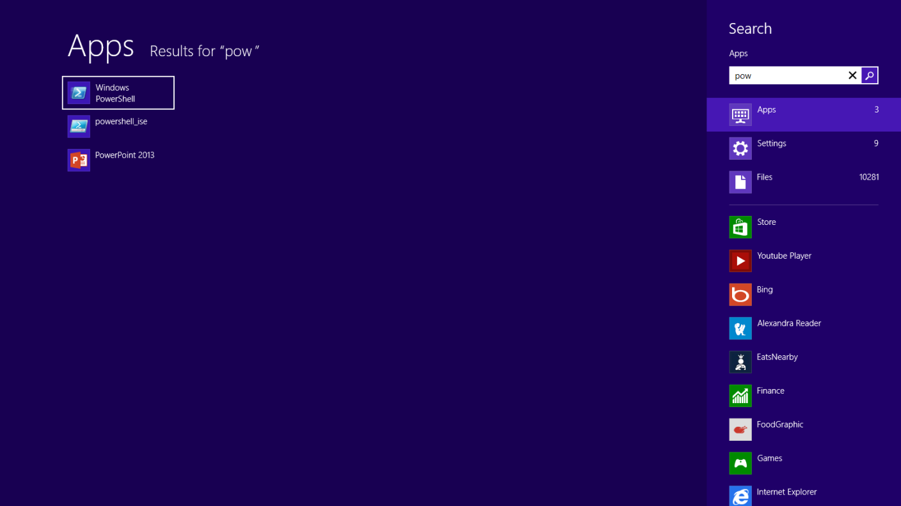
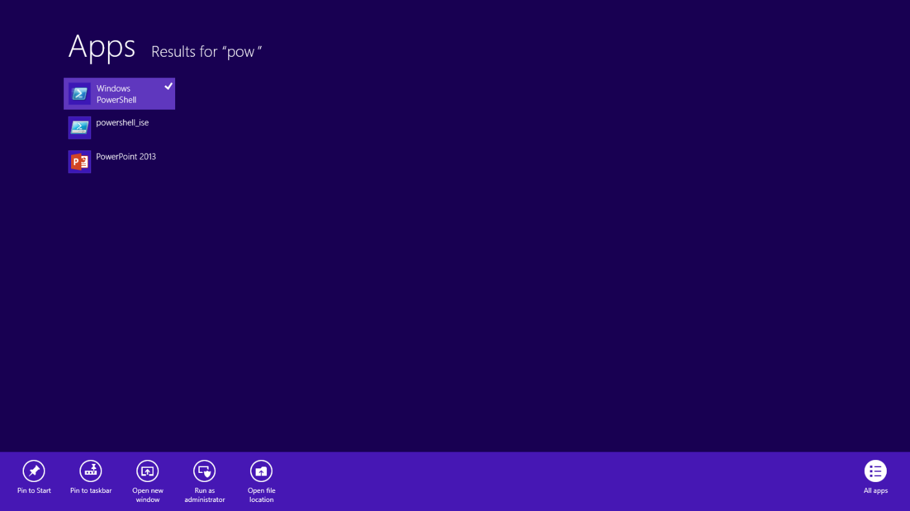

# Windows PowerShell Basics - Introduction

Windows PowerShell is not new technology. Windows PowerShell 4.0 ships in Windows 8.1 and in Windows Server 2012 R2, it has therefore been around for a while. Windows PowerShell is an essential admin tool designed specifically for Windows administration. By learning to use Windows PowerShell, network administrators quickly gain access to information from Windows Management Instrumentation, Active Directory and other essential sources of information. Additionally, Microsoft added Windows PowerShell support to the Common Criteria requirements for shipping enterprise applications. Therefore, to manage Microsoft Exchange, Azure, SQL Server, and others one needs to know and to understand how to use Windows PowerShell. In the networking world, this knowledge is also a requirement for managing DNS, DHCP, Network Adapters, and other components.

## So what are the basics of Windows PowerShell that I need to know?

Windows PowerShell comes in two flavors - the first is an interactive console (sort of like a KORN or a BASH console in the UNIX world) built into the Windows command prompt. The Windows PowerShell console makes it simple to type short commands and to receive sorted, filtered, formatted results. These results easily display to the console, but can redirect to XML, CSV, or text files. The Windows PowerShell console offers several advantages such as speed, low memory overhead, and a comprehensive transcription service that records all commands and command output.

There is also the Windows PowerShell ISE. The Windows PowerShell ISE is an Integrated Scripting Environment, but this does not mean you must use it to write scripts. In fact, many Windows PowerShell users like to write their code in the Windows PowerShell ISE to take advantage of the color syntax-highlighting, drop down lists, and automatic parameter revelation features. In addition, the Windows PowerShell ISE has a feature, called the _Show Command Add-On _that permits using a mouse to create Windows PowerShell commands from a graphical environment. Once created, the command either runs directly, or adds to the script pane (the choice is up to you).

## Working with Windows PowerShell

On Windows 8 or on Windows Server 2012 Windows PowerShell 3.0 already exists. On Windows 8.1 Windows PowerShell 4.0 is installed, as it is on Windows Server 2012 R2. Windows 8 (and 8.1) you only need to type the first few letters of the word PowerShell on the Start screen before Windows PowerShell appears as an option. The figure appearing here illustrates this point. I only typed _pow _before the Start screen search box changes to offer Windows PowerShell and an option.

Because navigating to the Start screen and typing _pow _each time I want to launch Windows PowerShell is a bit cumbersome, I prefer to Pin the Windows PowerShell console (and the Windows PowerShell ISE) to both the Start page and to the Windows desktop taskbar. This technique of pinning shortcuts to the applications provides single click access to Windows PowerShell from wherever I may be working.

On Windows Server 2012 (and on Windows Server 2012 R2), it is not necessary to go through the Start screen / Search routine because an icon for the Windows PowerShell console exists by default on the taskbar of the desktop.

**NOTE** : The Windows PowerShell ISE (the script editor) does not exist by default on Windows Server 2012 and Windows Server 2012 R2. You add the Windows PowerShell ISE as a feature.

