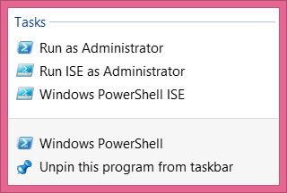

# Windows PowerShell Basics - Security issues with Windows PowerShell
There are two ways of launching Windows PowerShell - as an administrator and as a normal user. It is a best practice when starting Windows PowerShell to start it with minimum rights. On Windows 8 (and on Windows 7) this means simply clicking on the Windows PowerShell icon. It opens as a non-elevated user (even if you are logged on with Administrative rights). On Windows Server 2012, Windows PowerShell automatically launches with the rights of the current user and therefore if you are logged on as a Domain Administrator, the Windows PowerShell console launches with Domain Administrator rights.

## Running as a normal (non-elevated) user

Because Windows PowerShell adheres to Windows security constraints, a user of Windows PowerShell cannot do anything that the user account does not have permission to do. Therefore, if you are a non-elevated normal user, you will not have rights to do things like install printer drivers, read from the Security log, or change system time.

Even if you are an administrator on the local Windows 8 (or Windows 7) desktop machine and you do not launch Windows PowerShell with admin rights, you will get errors when attempting to do things like see the configuration of your disk drives. This command and associated error appears here.
```
PS C:\> get-disk  
get-disk : Access to a CIM resource was not available to the client.  
At line:1 char:1  
+ get-disk  
+ ~~~~~~~~  
  + CategoryInfo     : PermissionDenied: (MSFT\_Disk:ROOT/Microsoft/Windows/S  
  torage/MSFT\_Disk) [Get-Disk], CimException  
  + FullyQualifiedErrorId : MI RESULT 2,Get-Disk
```
**TIP** : There is an inconsistency with errors arising when attempting to run cmdlets that require elevated rights. For example, when inside a non-elevated Windows PowerShell console, the error from Get-Disk is _Access to a CIM resource was not available to the client. _The error from Stop-Service is _Cannot open xxx service on computer. _While the Get-VM cmdlets simply returns no information (an no error). Therefore, as a first step in troubleshooting, check for console rights.

## Launching PowerShell with Admin rights

When you need to perform tasks that require Admin rights, you need to start the Windows PowerShell console with admin rights. To do this, right click on the Windows PowerShell icon (from either the one pinned to the task bar, the start page, or even from the one found from the Start / Search page) and select the _Run As Administrator _option from the action menu. The great thing about this technique is that it permits launching either the Windows PowerShell console (the first item on the menu) as an Administrator, or from the same screen you can launch the Windows PowerShell ISE as an Administrator. This appears in the figure that follows.



Once you launch the Windows PowerShell console with admin rights, the User Account Control dialog box appears seeking permission to allow Windows PowerShell to make changes to the computer. In reality, Windows PowerShell is not making changes to the computer - not yet. But using Windows PowerShell you can certainly make changes to the computer - if you have the rights, and this is what the dialog is prompting you for.

**NOTE** : It is possible to avoid this prompt by turning off User Account Control (UAC). However, UAC is a significant security feature, and therefore I do not recommend disabling UAC. We have fine-tuned it in Windows 7 and continuing through Windows 8.1 and greatly reduced the number of UAC prompts (from the number that used to exist in the introduction of UAC on Windows Vista. This is not "your grandma's UAC".)

Now that you are running Windows PowerShell with admin rights, you can do anything your account has permission to do. Therefore, if you were to, for example, run the Get-Disk cmdlets, you would see information similar to the following appear.
```
PS C:\> get-disk  
  
  
Number Friendly Name              OperationalS Total Size Partition  
                        tatus          Style  
------ -------------              ------------ ---------- -----------  
0   INTEL SSDSA2BW160G3L           Online     149.05 GB MBR
```

