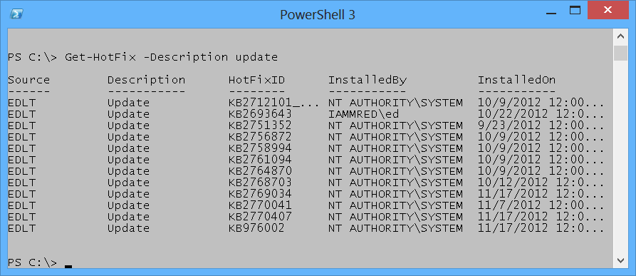

# Windows PowerShell Basics - Supplying options for cmdlets
The easiest Windows PowerShell cmdlets to use require no options. But unfortunately, that is only a fraction of the total number of cmdlets (and functions) available in Windows PowerShell 4.0 as it exists on either Windows 8.1 or Windows Server 2012 R2. Fortunately, the same Tab Expansion technique used to create the cmdlet names on the Windows PowerShell console, works with **parameters** as well.

## Using single parameters

When working with Windows PowerShell cmdlets, often the cmdlet only requires a single parameter to filter out the results. If a parameter is the default parameter, you do not have to specify the parameter name - you can use the parameter positionally. This means that the first value appearing after the cmdlet name, is assumed to be a value for the default (or position 1) parameter. On the other hand, if a parameter is a **named parameter** the parameter name (or parameter alias or partial parameter name) is always required when using the parameter.

### Finding specific types of hotfixes 

For example to find all of the _update _hotfixes, use the Get-HotFix cmdlet with the -Description parameter and supply a value of _update _to the -Description parameter. This is actually easier than it sounds. Once you type Get-Hot and press the <TAB> key you have the Get-Hotfix portion of the command. Then a space and -D <TAB> completes the Get-HotFix -Description portion of the command. Now you need to type Update and press <ENTER>. With a little practice, using Tab Expansion becomes second nature. You only need to type the following:
```
Get-Hot + <TAB> + -D + <TAB> + Update + <ENTER>
```
The completed command and the output associated with the command appear in the figure that follows.



If you attempt to find only update types of hotfixes by supplying the value _update _in the first position, an error raises. The offending command, and associated error, appears here.
```
PS C:\> Get-HotFix update  
Get-HotFix : Cannot find the requested hotfix on the 'localhost' computer. Verify  
the input and run the command again.  
At line:1 char:1  
+ Get-HotFix update  
+ ~~~~~~~~~~~~~~~~~  
  + CategoryInfo     : ObjectNotFound: (:) [Get-HotFix], ArgumentException  
  + FullyQualifiedErrorId : GetHotFixNoEntriesFound,Microsoft.PowerShell.Commands  
  .GetHotFixCommand
```
The error, while not really clear, seems to indicate that the Get-HotFix cmdlet attempts to find a hotfix named _update. _This is, in fact, the attempted behavior. The help file information for the Get-HotFix cmdlet reveals that -ID is position 1. This appears here.
```
  -Id <String[]>  
    Gets only hotfixes with the specified hotfix IDs. The default is all  
    hotfixes on the computer.  
  
  
    Required?          false  
    Position?          1  
    Default value        All hotfixes  
    Accept pipeline input?    false  
    Accept wildcard characters? False
```
Well, what about using the -Description parameter, you may ask? The help file tells that the -Description parameter is a named parameter. This means you can only use the -Description parameter if you specify the parameter name as was accomplished earlier in this section. Here is the applicable portion of the help file for the -Description parameter.
```
  -Description <String[]>  
    Gets only hotfixes with the specified descriptions. Wildcards are  
    permitted. The default is all hotfixes on the computer.  
  
  
    Required?          false  
    Position?          named  
    Default value        All hotfixes  
    Accept pipeline input?    false  
    Accept wildcard characters? True
```
### Finding specific processes

To find process information about a single process, I use the -Name parameter. Because the -Name parameter is the default (position 1) parameter for the Get-Process cmdlet, you do not have to specify the -Name parameter when calling Get-Process if you do not wish to do so. For example, to find information about the PowerShell process by using the Get-Process cmdlet type the following command in the first line of the Windows PowerShell console by using Tab Expansion:
```
Get-Pro + <TAB> + <SPACE> + Po + <TAB> + <ENTER>
```
The completed command and associated output appears here.
```
PS C:\> Get-Process powershell  
  
  
Handles NPM(K)  PM(K)   WS(K) VM(M)  CPU(s)   Id ProcessName  
------- ------  -----   ----- -----  ------   -- -----------  
  607   39  144552   164652  718   5.58  4860 powershell
```
You can tell that the Get-Process cmdlet accepts the -Name parameter in a positional manner because the Help file states it is in position 1. This appears here.
```
  -Name <String[]>  
    Specifies one or more processes by process name. You can type multiple  
    process names (separated by commas) and use wildcard characters. The  
    parameter name ("Name") is optional.  
  
  
    Required?          false  
    Position?          1  
    Default value  
    Accept pipeline input?    true (ByPropertyName)  
    Accept wildcard characters? True
```
**NOTE** : Be careful using positional parameters. This is because they can be confusing. For example, the first parameter for the Get-Process cmdlet is the -Name parameter, but the first position parameter for the Stop-Parameter is the -ID parameter. As a best practice always refer to the Help files to see what the parameters actually are called, and the position in which they are expected. This is even more important when using cmdlet with multiple parameters - such as the Get-Random cmdlet discussed next.

### Generating random numbers in a range

When used without any parameters, the Get-Random cmdlet returns a number that is in the range of 0 to 2,147,483,647. We have never had a Windows PowerShell user group meeting in which there were either 0 people in attendance, nor have we had a Windows PowerShell user group meeting with 2,147,483,647 people in attendance. Therefore when handing out prizes at the end of the day, it is important to set a different minimum and maximum number.

**NOTE** : When using the -Maximum parameter for the Get-Random cmdlet keep in mind that the maximum number never appears. Therefore, if you have 15 people attending your Windows PowerShell user group meeting, you would want to set the -Maximum parameter to 16 (unless you do not like the 15 person and do not want them to win any prizes).

The default parameter for the Get-Random cmdlet is the -Maximum parameter. This means that you can use the Get-Random cmdlet to generate a random number in the range of 0 to 20 by using Tab Expansion on the first line of the Windows PowerShell console. Type the following (remember Get-Random never reaches the maximum number, therefore always use a number 1 greater than the desired upper number):
```
Get-R + <TAB> + <SPACE> + 21
```
If you want to generate a random number between 1 and 20, you might think you could use Get-Random 1 21, but that generates an error. The command and the error appear here.
```
PS C:\> Get-Random 1 21  
Get-Random : A positional parameter cannot be found that accepts argument '21'.  
At line:1 char:1  
+ Get-Random 1 21  
+ ~~~~~~~~~~~~~~~  
  + CategoryInfo     : InvalidArgument: (:) [Get-Random], ParameterBindingEx  
  ception  
  + FullyQualifiedErrorId : PositionalParameterNotFound,Microsoft.PowerShell.Comm  
  ands.GetRandomCommand
```
The error states that _a positional parameter cannot be found that accepts argument '21'_. This is because the Get-Random only has one positional parameter - the -Maximum parameter. The -Minimum parameter is a named parameter (this appears in the Help file for the Get-Random cmdlet. Use of the Help files appears in Chapter two).

To generate a random number in the range of 1 to 20, use named parameters. To assist in creating the command use Tab Expansion for the cmdlet name as well as for the parameter names. Type the following to create the command using Tab Expansion.
```
Get-R + <TAB> + -M + <TAB> + <SPACE> + 21 + -M + <TAB> + <SPACE> + 1 + <ENTER>
```
The command and the output associated with the command appears here.
```
PS C:\> Get-Random -Maximum 21 -Minimum 1  
19
```
### An introduction to parameter sets

One of the things that quickly becomes confusing with Windows PowerShell cmdlets is that there are often different ways of using the same cmdlet. For example, you can specify the -Minimum and the -Maximum parameters, but you cannot also specify the -Count parameter. This is a bit unfortunate, because it would seem that using the -Minimum and the -Maximum parameters to specify the minimum and the maximum numbers for the random numbers makes sense. When the Windows PowerShell user group has five prizes to give away it is inefficient to have to either write a script to generate the five random numbers. It is also inefficient to have to run the same command five times.

This is where command sets come into play. The -Minimum and the -Maximum parameters specify the range within which to pick a single random number. To generate more than one random number use the -Count parameter. Here are the two parameter sets.
```
Get-Random [[-Maximum] <Object>] [-Minimum <Object>] [-SetSeed <Int32>]  
[<CommonParameters>]  
  
  
Get-Random [-InputObject] <Object[]> [-Count <Int32>] [-SetSeed <Int32>]  
[<CommonParameters>]
```
The first parameter set accepts -Maximum, -Minimum and -SetSeed. The second parameter set accepts -InputObject, -Count and -SetSeed. Therefore you cannot use -Count with -Minimum or -Maximum - they are in two different groups of parameters (called parameter sets).

**NOTE** : It is quite common for Windows PowerShell cmdlets to have multiple parameter sets. Tab Expansion only offers parameters from one parameter set - therefore when you choose a parameter (such as -Count from Get-Random) the non-compatable parameters do not appear in tab Expansion. This feature keeps you from creating invalid commands. For an overview of a cmdlets parameter sets, use the Get-Help cmdlet.

### Generating a certain number of random numbers

The Get-Random cmdlet, when used with the -Count parameter accepts an -InputObject parameter. The -InputObject parameter is quite powerful. The help file, appearing here, states that it accepts a collection of objects.
```
-InputObject <Object[]>  
  Specifies a collection of objects. Get-Random gets randomly selected  
  objects in random order from the collection. Enter the objects, a variabl  
  that contains the objects, or a command or expression that gets the  
  objects. You can also pipe a collection of objects to Get-Random.  
  
  
  Required?          true  
  Position?          1  
  Default value  
  Accept pipeline input?    true (ByValue)  
  Accept wildcard characters? False
```
An array (or a range) of numbers just happens to also be a collection of objects. The easiest way to generate a range (or an array) of numbers is to use the range operator. The **range operator** is two dots (periods) between two numbers. The **range operator** does not require spaces between the numbers, and dots. This appears here.
```
PS C:\> 1..5  
1  
2  
3  
4  
5
```
Now to pick five random numbers from the range of 1 to 10, only requires the command appearing here. (The parentheses are required around the range of 1 to 10 numbers to ensure the range of numbers creates prior to attempting to select five from the collection.
```
Get-Random -InputObject (1..10) -Count 5
```
The command and output associated with the command appear here.
```
PS C:\> Get-Random -InputObject (1..10) -Count 5  
7  
5  
10  
1  
8
```
