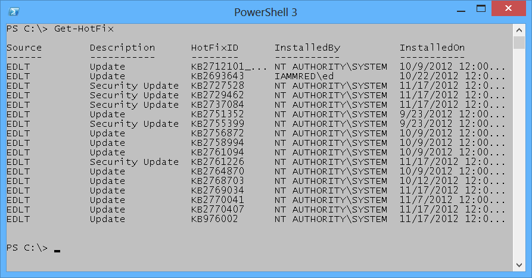

# Windows PowerShell Basics - Using PowerShell cmdlets
PowerShell cmdlets all work in a similar fashion. This simplifies their use. All Windows PowerShell cmdlets have a two-part name. The first part is a verb (not always strictly a grammatical verb however). The *verb* indicates the action for the command to take. Examples of verbs include Get, Set, Add, Remove, or Format. The *noun* is the thing to which the action will apply. Examples of nouns include Process, Service, Disk, or NetAdapter. A dash combines the verb with the noun to complete the Windows PowerShell command. Windows PowerShell commands, named cmdlets (pronounced command let), because they behave like small commands or programs are used standalone, or pieced together via a mechanism called the *pipeline* (refer to chapter two for the use of the *pipeline* ).

The most common verb - `Get`

Out of nearly 2,000 cmdlets (and functions) on Windows 8, over 25 percent of them use the verb *Get.* The verb *Get* retrieves information. The Noun portion of the cmdlet specifies the information retrieved. To obtain information about the processes on your system, open the Windows PowerShell console by either clicking on the Windows PowerShell icon on the task bar (or typing PowerShell on the start screen of Windows 8 to bring up the search results for Windows PowerShell (as illustrated earlier)). Once the Windows PowerShell console appears, run the Get-Process cmdlet. To do this, use the Windows PowerShell Tab Completion feature to complete the cmdlet name. One the cmdlet name appears, press the <ENTER> key to cause the command to execute.

**NOTE** : The Windows PowerShell Tab Completion feature is a great time saver. It not only saves time (by reducing the need for typing) but it also helps to ensure accuracy, because Tab Completion accurately resolves cmdlet names - it is sort of like a spell checker for cmdlet names. For example, attempting to type a cmdlet name such as Get-NetAdapterEncapsulatedPacketTaskOffload accurately (for me anyway) could be an exercise in frustration. But using tab completion, I only have to type Get-Net and I hit the <TAB> key about six times and the correctly spelled cmdlet name appears in the Windows PowerShell console. Learning how to quickly, and efficiently use the tab completion is one of the keys to success in using Windows PowerShell.

### Finding process information

To use the Windows PowerShell Tab Completion feature to enter the Get-Process cmdlet name onto the Windows PowerShell console command line, type the following on the first line of the Windows PowerShell console:
```
Get-Pro + <tab> + <ENTER>
```
The Get-Process command and the associated output from the cmdlet appear in the figure that follows.


To find information about Windows services, use the verb **Get** and the **noun** service. To type the cmdlet name, type the following:
```
Get-Servi + <TAB> + <ENTER>
```
**NOTE** : It is a Windows PowerShell convention to use singular nouns. While not universally applied (my computer has around 50 plural nouns) it is a good place to start. So if you are not sure if a noun (or parameter) is singular or plural, choose the singular - most of the time you will be correct.

### Identifying installed Windows Hotfixes

To find a listing of Windows Hotfixes applied to the current Windows installation, use the Get-Hotfix cmdlet (the **verb** is Get and the **noun** is Hotfix). Inside the Windows PowerShell console, type the following:
```
Get-Hotf + <TAB> + <ENTER>
```
The command, and the output associated with the command appear here.



### Get detailed service information

To find information about services on the system, use the Get-Service cmdlet. Once again, it is not necessary to type the entire command. The following command uses Tab Expansion to complete the Get-Service command and to execute it.
```
Get-Servi + <TAB> + <ENTER>
```
**NOTE** : The efficiency of Tab Expansion depends upon the number of cmdlets, functions, or modules installed on the computer. As more commands become available, the efficiency of Tab Expansion reduces correspondingly.

The following (truncated) output appears following the Get-Service cmdlet.
```
PS C:\> Get-Service  
  
  
Status  Name        DisplayName  
------  ----        -----------  
Running AdobeActiveFile... Adobe Active File Monitor V6  
Stopped AeLookupSvc    Application Experience  
Stopped ALG        Application Layer Gateway Service  
Stopped AllUserInstallA... Windows All-User Install Agent  
<TRUNCATED OUTPUT>
```
### Identifying installed network adapters

To find information about network adapters on your Windows 8 (or Windows Server 2012) machine, use the Get-NetAdapter cmdlet. Using Tab Expansion, type the following:
```
Get-NetA + <TAB> + <ENTER>
```
The command and associated output appear here.
```
PS C:\> Get-NetAdapter  
  
  
Name           InterfaceDescription          ifIndex Status  
----           --------------------          ------- ------  
Network Bridge      Microsoft Network Adapter Multiplexo...   29 Up  
Ethernet         Intel(R) 82579LM Gigabit Network Con...   13 Not Pre...  
vEthernet (WirelessSwi... Hyper-V Virtual Ethernet Adapter #4     31 Up  
vEthernet (External Sw... Hyper-V Virtual Ethernet Adapter #3     23 Not Pre...  
vEthernet (InternalSwi... Hyper-V Virtual Ethernet Adapter #2     19 Up  
Bluetooth Network Conn... Bluetooth Device (Personal Area Netw...   15 Disconn...  
Wi-Fi           Intel(R) Centrino(R) Ultimate-N 6300...   12 Up
```
### Retrieving detected network connection profiles

If you want to see the network connection profile that Windows 8 (or Windows Server 2012) detected for each interface, use the Get-NetConnectionProfile cmdlet. To run this command, use the following command with Tab Expansion.
```
Get-NetC + <TAB> + <ENTER>
```
The command and associated output appear here.
```
PS C:\> Get-NetConnectionProfile  
  
  
  
  
Name       : Unidentified network  
InterfaceAlias  : vEthernet (InternalSwitch)  
InterfaceIndex  : 19  
NetworkCategory : Public  
IPv4Connectivity : NoTraffic  
IPv6Connectivity : NoTraffic  
  
  
Name       : Network 10  
InterfaceAlias  : vEthernet (WirelessSwitch)  
InterfaceIndex  : 31  
NetworkCategory : Public  
IPv4Connectivity : Internet  
IPv6Connectivity : NoTraffic
```
**NOTE** : Windows PowerShell is not case sensitive. There are a few instances where case sensitivity is an issue (for example when using Regular Expressions) but cmdlet names, parameters and values are not case sensitive. Windows PowerShell convention uses a combination of upper case and lower case letters (generally at syllable breaks in long noun names such as NetConnectionProfile) but this is not a requirement for Windows PowerShell to interpret accurately the command. This combination of upper case and lowercase letters are for readability. If you use Tab Expansion, Windows PowerShell automatically converts the commands to this fashion.

### Getting the current culture settings

There are two types of culture settings on a typical Windows computer. There are the culture settings for the current culture settings. This includes information about the keyboard layout, and the display format of items such as numbers, currency, and dates. To find the value of these cultural settings, use the Get-Culture cmdlet. To call the Get-Culture cmdlet using Tab Expansion to complete the command, type the following on the current line of the Windows PowerShell console:
```
Get-Cu + <TAB> + <ENTER>
```
When the command runs basic information such as the Language Code ID number (LCID), the name of the culture settings, as well as the display name of the culture settings return to the Windows PowerShell console. The command and associated output appears here.
```
PS C:\> Get-Culture  
  
  
LCID       Name       DisplayName  
----       ----       -----------  
1033       en-US      English (United States)
```
The second culture related grouping of information is the current user interface (UI) settings for Windows. The UI culture settings determine which text strings appear in user interface elements such as menus and error messages. To determine the current UI culture settings that are active use the Get-UICulture cmdlet. Using Tab Expansion to call the Get-UICulture cmdlet, type the following:
```
Get-Ui + <TAB> + <ENTER>  
```
The command and output associated from the command appears here.   
```
PS C:\> Get-UICulture  
  
  
LCID       Name       DisplayName  
----       ----       -----------  
1033       en-US      English (United States)
```

**NOTE** : On my laptop, both the current culture and the current UI culture are the same. This is not always the case, and at times, I have seen machines become rather confused when the user interface is set for a localized language, and yet the computer itself was still set for US English (this is especially problematic when using virtual machines created in other countries. In these cases, even a simple task like typing in a password becomes very frustrating. To fix these types of situations you can use the Set-Culture cmdlet.

### Finding the current date and time

To find the current date or time on the local computer, use the Get-Date cmdlet. When typing the Get-Date cmdlet name in the Windows PowerShell console tab expansion does not help too much. This is because there are 15 cmdlets (on my laptop) that have a cmdlet name that begins with the letters Get-Da (this includes all of the Direct Access cmdlets as well as the Remote Access cmdlets). Therefore using Tab Expansion (on my laptop anyway) to get the date requires me to type the following:
```
Get-Dat + <TAB> + <Enter>
```
The above command syntax is just the same number of letters to type as doing the following:
```
Get-Date + <ENTER>
```
The following illustrates the command and the output associated with the command.
```
PS C:\> Get-Date  
```  
  
Tuesday, November 20, 2012 9:54:21 AM

### Generating a random number

Windows 2.0 introduced the Get-Random cmdlet, and when I saw it I was not too impressed. The reason was that I already knew how to generate a random number. Using the .NET Framework System.Random class, all I needed to do was create a new instance of the System.Random object, and call the _next _method. This appears here.
```
PS C:\> (New-Object system.random).next()  
225513766
```
Needless to say, I did not create all that many random numbers. I mean, who wants to do all that typing. But once I had the Get-Random cmdlet, I actually began using random numbers for all sorts of things. Some of the things I have used the Get-Random cmdlet to do appear in the following list.

   * Pick prize winners for the Scripting Games

   * Pick prize winners for Windows PowerShell user group meetings

   * To connect to remote servers in a random fashion for load balancing purposes

   * To create random folder names

   * To create temporary users in active directory with random names

   * To wait a random amount of time prior to starting or stopping processes and services (great for performance testing)

The Get-Random cmdlet has turned out to be one of the more useful cmdlets. To generate a random number in the Windows PowerShell console using Tab Expansion type the following on the first line in the console:
```
Get-R +<TAB>+<ENTER>
```
The command, and output associated with the command appears here.
```
PS C:\> Get-Random  
248797593
```

